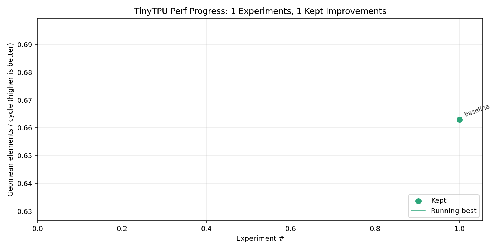

# TinyTPU

A TPU implemented in Bluespec SystemVerilog (BSV), with a tinygrad co-simulation backend. Every tensor operation compiles through tinygrad and executes on the cycle-accurate BSV simulator.

The project is developed almost entirely through AI coding agents (Claude Code and Codex). `AGENT.md` defines the autonomous iteration loop, `CLAUDE.md` configures Claude Code, and `TODO.md` tracks tinyspec coverage. See [Developing with AI Agents](#developing-with-ai-agents) for details.

## Architecture

```
TinyTPUChip
├── TensorCore (TC0)
│   ├── ScalarUnit (SXU)     — microprogram sequencer
│   ├── SystolicArray (MXU)  — 4x4 int8 matrix multiply, int32 accumulate
│   ├── Controller           — drives MXU through WeightSRAM/ActivationSRAM
│   ├── VPU                  — vector processing unit (10 ops)
│   ├── XLU                  — lane permutations (rotate, broadcast, permute, transpose)
│   ├── VMEM                 — unified scratchpad (16 tiles x 4x4 x Int#(32))
│   └── VRegFile             — 16 vector registers
├── SparseCore               — embedding table lookup with sum-pooling
├── HBMModel                 — behavioral HBM with configurable read latency
└── ChipNoC                  — ring network-on-chip connecting all units
```

## What Works Today

**GEMM** — Tiled int8 matrix multiply with int32 accumulation. Multi-row, batched, deep-K, wide-N shapes through the 4x4 MXU.

**Elementwise** — ADD, SUB, MUL, MAX, CMPLT, CMPNE, CMPEQ, RELU, NEG, WHERE, AND, OR, XOR, NOT. All work on arbitrary-length int32 tensors via automatic multi-tile chunking. Scalar constant variants (`x + 1`, `x < 3`, `x == 0`) and reverse constants (`5 - x`) are supported.

**Reductions** — SUM and MAX to scalar, any length. Multi-tile reductions use VPU hardware (VPU_SUM_REDUCE, VPU_MAX_REDUCE) per tile with host-side accumulation.

81 sim-backed tests run on the real BSV simulator (see `tests/test_tinytpu_backend_gemm.py`). 114 total Python tests including profiler and runtime tooling.

## Quick Start

```python
from tinygrad import Tensor

# Matrix multiply — runs on the BSV TensorCore simulator
a = Tensor([[1, 2, 3, 4], [5, 6, 7, 8]], dtype="int32", device="TINYTPU")
w = Tensor([[1,0,0,0],[0,1,0,0],[0,0,1,0],[0,0,0,1]], dtype="int32", device="TINYTPU")
print((a @ w).numpy())  # [[1 2 3 4] [5 6 7 8]]

# Elementwise ops
x = Tensor([1, -2, 3, -4], dtype="int32", device="TINYTPU")
print(x.relu().numpy())         # [1 0 3 0]
print((x + 10).numpy())         # [11 8 13 6]
print((x > 0).numpy())          # [True False True False]

# Reductions
print(Tensor([3, 7, 1, 5], dtype="int32", device="TINYTPU").sum().numpy())  # 16
print(Tensor([3, 7, 1, 5], dtype="int32", device="TINYTPU").max().numpy())  # 7
```

## Performance

`scripts/benchmark_tinytpu.py` runs an 11-kernel benchmark suite through the
cycle-accurate BSV simulator and reports latency (cycles) and throughput
(int32 elements/cycle). Per-kernel numbers for the current baseline:

| kernel          | cycles | elems/cycle | bytes/cycle |
|-----------------|-------:|------------:|------------:|
| add_16          |     33 |       0.485 |        1.94 |
| add_256         |    423 |       0.605 |        2.42 |
| relu_64         |     83 |       0.771 |        3.08 |
| reshape_64      |     63 |       1.016 |        4.06 |
| sum_16_scalar   |     26 |       0.615 |        2.46 |
| sum_256_scalar  |    281 |       0.911 |        3.64 |
| rowsum_8x8      |     79 |       0.810 |        3.24 |
| colsum_8x8      |     79 |       0.810 |        3.24 |
| gemm_1x4x4      |     37 |       0.432 |        1.73 |
| gemm_4x4x4      |    121 |       0.529 |        2.12 |
| gemm_4x8x4      |    227 |       0.564 |        2.26 |
| **geomean**     |        |   **0.663** |             |

We track the **geomean of elements/cycle** across all kernels as the
single-number progress metric — scale-invariant (a 2× wider MXU/VPU should
move the geomean proportionally), independent of kernel mix, and rises with
any real speedup.



Progress is tracked in `doc/benchmark_history.tsv`; re-render the plot with:

```sh
python3 scripts/benchmark_tinytpu.py            # print per-kernel table
python3 scripts/benchmark_tinytpu.py --json     # machine-readable
python3 scripts/plot_benchmark.py               # update doc/benchmark_progress.png
```

## Prerequisites

- [BSC compiler](https://github.com/B-Lang-org/bsc) (Bluesim backend)
- GNU Make
- Python >= 3.11 with numpy and pytest

## Build and Test

```sh
# Build the co-simulation runtime (required for Python tests)
make runtime-tb

# Run all BSV hardware unit tests
make test

# Run the sim-backed Python test suite (81 tests through the real simulator)
PYTHONPATH=tinygrad python3 -m pytest tests/test_tinytpu_backend_gemm.py -x -v

# Run all Python tests (114 tests including profiler/tooling)
PYTHONPATH=tinygrad python3 -m pytest tests/ -x -v

# Run end-to-end co-simulation
python3 scripts/test_cosim.py

# Individual BSV unit tests
make test-pe          # Processing element
make test-array       # Systolic array
make test-accel       # TensorAccelerator (legacy)
make test-4x4         # 4x4 parameterization
make test-xlu         # Cross-Lane Unit
make test-vmem        # Vector memory scratchpad
make test-vregfile    # Vector register file
make test-vpu         # Vector processing unit (10 ops)
make test-sxu         # Scalar unit microprogram
make test-tc          # TensorCore end-to-end GEMM
make test-sc          # SparseCore embedding lookup
make test-hbm         # HBM behavioral model
make test-noc         # On-chip ring NOC
make test-chip        # Full chip pipeline

make clean            # Remove build artifacts
```

## Project Structure

```
tinytpu/
├── src/                        # BSV hardware modules
│   ├── PE.bsv                  #   Systolic array processing element
│   ├── SystolicArray.bsv       #   Parameterized systolic array
│   ├── WeightSRAM.bsv          #   Weight tile SRAM for MXU
│   ├── ActivationSRAM.bsv      #   Activation vector SRAM for MXU
│   ├── Controller.bsv          #   MXU FSM controller
│   ├── TensorAccelerator.bsv   #   Legacy top-level (MXU+SRAMs+Controller)
│   ├── VPU.bsv                 #   Vector processing unit (10 ops including reductions)
│   ├── XLU.bsv                 #   Cross-Lane Unit (rotate/broadcast/permute/transpose)
│   ├── VMEM.bsv                #   Unified scratchpad SRAM, 1-cycle read
│   ├── VRegFile.bsv            #   Vector register file
│   ├── ScalarUnit.bsv          #   Microprogram sequencer
│   ├── TensorCore.bsv          #   SXU + MXU + VPU + XLU + VMEM + VRegFile
│   ├── SparseCore.bsv          #   Embedding lookup with sum-pooling
│   ├── HBMModel.bsv            #   Behavioral HBM model
│   ├── ChipNoC.bsv             #   Token-ring NOC
│   └── TinyTPUChip.bsv         #   Chip top-level
├── test/                       # BSV testbenches (one per hardware module)
│   ├── TbVPU.bsv               #   10 VPU op tests
│   ├── TbTinyTPURuntime.bsv    #   Co-simulation runtime testbench
│   └── ...
├── bdpi/                       # BDPI C helpers for co-simulation I/O
│   └── tinytpu_io.c
├── tinygrad/                   # tinygrad submodule (fork: hanw/tinygrad)
│   └── tinygrad/runtime/
│       └── ops_tinytpu.py      #   TINYTPU device: renderer, allocator, program driver
├── tests/                      # Python test suite
│   ├── test_tinytpu_backend_gemm.py   # 81 sim-backed backend tests
│   ├── test_run_tinytpu.py            # Runtime/profiler tests
│   └── test_profile_tpu.py           # Profiler tooling tests
├── scripts/                    # Development and profiling scripts
│   ├── test_cosim.py           #   End-to-end co-simulation test
│   ├── run_tinytpu.py          #   Standalone runtime runner
│   ├── dump_tinytpu_bundle.py  #   Bundle inspection utility
│   ├── profile_tpu.py          #   Profiler driver (text report + Perfetto JSON)
│   ├── gen_viz.py              #   Regenerate viz_pipeline.html from a bundle/TASM
│   ├── viz_pipeline.html       #   Self-contained pipeline timeline visualizer
│   ├── tasm.py                 #   TASM assembler / disassembler
│   └── run_tinytpu_upstream_subset.py  # Selected upstream tinygrad tests
├── doc/                        # Design specs and implementation plans
├── AGENT.md                    # Autonomous agent iteration workflow
├── CLAUDE.md                   # Claude Code configuration
├── TODO.md                     # Tinyspec coverage tracker (~250-400 iterations remaining)
├── results.tsv                 # Per-iteration progress log
└── Makefile                    # BSV build and test targets
```

## Pipeline Visualizer

`scripts/viz_pipeline.html` is a self-contained, zero-dependency HTML timeline
that shows cycle-accurate execution across all four TensorCore units — SXU,
MXU, VPU, and VMEM — as a Gantt chart you can zoom, pan, and hover over.

```
Cycle →   0    3    6    9   12   15   18   21   24
───────────────────────────────────────────────────
 SXU │FETCH│LDQ│LDR│FETCH│LDQ│LDR│FETCH│VPU│COL│FETCH│MXU│WAIT×7         │FETCH│STOR│...
 MXU │                             │LOAD_W×4    │STREAM_A×4  │DRAIN│
 VPU │                        │EXC│RES│
 VMEM│     │RQ│RS│     │RQ│RS│                                    │WR│
```

The key story it reveals: after `DISPATCH_MXU` the SXU stalls in `WAIT_MXU`
(hatched red) while the MXU independently runs LOAD_W → STREAM_A → DRAIN.
Hover any block to see the TASM instruction, duration, and extra fields.

### Open the embedded test case

```sh
open scripts/viz_pipeline.html   # macOS
xdg-open scripts/viz_pipeline.html  # Linux
```

The file ships with a hard-coded 26-cycle trace of an 8-instruction program
(two LOADs, two VPU ops, an async MXU GEMM, a WAIT, a STORE, and HALT).  No
build step required.

### Generate a visualizer from a real simulator trace

First build the trace-enabled simulator (one-time, ~30 s):

```sh
make runtime-tb-trace
```

Then pick one of:

```sh
# Built-in sample bundle (identity GEMM + RELU, exercises all four units):
python3 scripts/gen_viz.py --sample -o sample.html
open sample.html

# Any TASM source file:
python3 scripts/gen_viz.py --tasm my_program.tasm -o my.html

# Pre-assembled numeric bundle:
python3 scripts/gen_viz.py my.bundle -o my.html
```

Alternatively, keep `viz_pipeline.html` as-is and use the **Load trace.json**
button to ingest a Perfetto trace produced by the profiler:

```sh
python3 scripts/profile_tpu.py my.bundle --trace-out trace.json
# then open viz_pipeline.html and click "Load trace.json"
```

### Controls

| Input | Action |
|-------|--------|
| Scroll wheel | Zoom in / out (centered on cursor) |
| Click-drag | Pan left / right |
| `+` / `-` | Zoom (centered on midpoint) |
| `←` / `→` | Pan 2 cycles |
| `R` | Fit whole trace to window |
| Hover | Tooltip with unit, event, duration, TASM instruction |

## Software Stack

```
tinygrad Tensor ops  (Python)
        |
        v
TinyTPURenderer      -- pattern-matches UOps, emits JSON descriptor
        |               (GEMM, VPU_BINARY, VPU_UNARY, VPU_WHERE)
        v
TinyTPUProgram       -- builds numeric text bundle from buffer data,
        |               invokes BSV simulator via subprocess,
        |               parses results back into output buffer
        v
mkTbTinyTPURuntime   -- BSV sim reads bundle via BDPI C helper,
                        drives TensorCore#(4,4,16), prints results
```

The tinygrad submodule is a fork at [hanw/tinygrad](https://github.com/hanw/tinygrad). The backend lives in `tinygrad/tinygrad/runtime/ops_tinytpu.py`.

## VPU Instruction Set

### Integer (Int#(32))

| Opcode | Type | Description |
|---|---|---|
| `VPU_ADD` | Binary | Element-wise addition |
| `VPU_SUB` | Binary | Element-wise subtraction |
| `VPU_MUL` | Binary | Element-wise multiplication |
| `VPU_DIV` | Binary | Element-wise division (div-by-zero yields 0) |
| `VPU_MAX` | Binary | Element-wise maximum |
| `VPU_MIN` | Binary | Element-wise minimum |
| `VPU_SHL` | Binary | Left shift by src2 (low 5 bits) |
| `VPU_SHR` | Binary | Right shift by src2 (low 5 bits) |
| `VPU_AND` | Binary | Bitwise AND |
| `VPU_OR` | Binary | Bitwise OR |
| `VPU_XOR` | Binary | Bitwise XOR |
| `VPU_CMPLT` | Binary | Less-than comparison (returns 0/1) |
| `VPU_CMPNE` | Binary | Not-equal comparison (returns 0/1) |
| `VPU_CMPEQ` | Binary | Equal comparison (returns 0/1) |
| `VPU_RELU` | Unary | max(x, 0) |
| `VPU_NOT` | Unary | Bitwise NOT |
| `VPU_COPY` | Unary | Identity (pass-through) |
| `VPU_SELECT` | Ternary | (src1!=0) ? src2 : resultReg (masked select) |

### Reductions

| Opcode | Axis | Description |
|---|---|---|
| `VPU_SUM_REDUCE` | per-row | Sum all lanes in each row, broadcast result |
| `VPU_MAX_REDUCE` | per-row | Max of all lanes in each row, broadcast |
| `VPU_MIN_REDUCE` | per-row | Min of all lanes in each row, broadcast |
| `VPU_MUL_REDUCE` | per-row | Product of all lanes in each row, broadcast |
| `VPU_SUM_REDUCE_COL` | per-column | Sum across sublanes, broadcast per column |
| `VPU_MAX_REDUCE_COL` | per-column | Max across sublanes, broadcast per column |
| `VPU_MIN_REDUCE_COL` | per-column | Min across sublanes, broadcast per column |
| `VPU_MUL_REDUCE_COL` | per-column | Product across sublanes, broadcast per column |
| `VPU_SUM_REDUCE_TILE` | full tile | Sum all elements, broadcast scalar |
| `VPU_MAX_REDUCE_TILE` | full tile | Max of all elements, broadcast scalar |
| `VPU_MIN_REDUCE_TILE` | full tile | Min of all elements, broadcast scalar |
| `VPU_MUL_REDUCE_TILE` | full tile | Product of all elements, broadcast scalar |

### Float32 (IEEE 754 bits carried in Int#(32))

| Opcode | Type | Description |
|---|---|---|
| `VPU_FADD` | Binary | Float32 add (round-nearest-even) |
| `VPU_FSUB` | Binary | Float32 subtract |
| `VPU_FMUL` | Binary | Float32 multiply |
| `VPU_FMAX` | Binary | Float32 maximum |
| `VPU_FCMPLT` | Binary | Float32 less-than (returns 0/1) |
| `VPU_FRECIP` | Unary | Reciprocal via magic-number + 3-step Newton-Raphson |
| `VPU_I2F` | Unary | int32 → float32 value conversion |
| `VPU_F2I` | Unary | float32 → int32 (truncate toward zero) |

## SXU Instruction Set

| Opcode | Fields | Description |
|---|---|---|
| `SXU_LOAD_VREG` | vmemAddr, vregDst | VMEM[addr] → VRF[dst] |
| `SXU_STORE_VREG` | vmemAddr, vregSrc | VRF[src] → VMEM[addr] |
| `SXU_DISPATCH_VPU` | vpuOp, src1, src2, dst | VPU op, result to VRF |
| `SXU_DISPATCH_SELECT` | cond, true, false, dst | Masked select via VPU_SELECT |
| `SXU_BROADCAST_SCALAR` | scalar, vregDst | Broadcast scalar to all lanes of a tile |
| `SXU_BROADCAST_ROW` | row, vregSrc, vregDst | Replicate one row across all sublanes |
| `SXU_BROADCAST_COL` | col, vregSrc, vregDst | Replicate one column across all lanes |
| `SXU_DISPATCH_XLU_BROADCAST` | xluOp, vregSrc, vregDst | XLU broadcast permutation |
| `SXU_DISPATCH_XLU_TRANSPOSE` | vregSrc, vregDst | XLU transpose |
| `SXU_DISPATCH_MXU` | wBase, aBase, tLen | Start MXU matrix multiply |
| `SXU_WAIT_MXU` | — | Stall until MXU done |
| `SXU_LOAD_MXU_RESULT` | vregDst | Move MXU result tile into VRF |
| `SXU_HALT` | — | Stop execution |

## Developing with AI Agents

This project is built through autonomous AI agent iterations. Each iteration adds one tested, committed capability. The workflow is defined in three files:

- **`AGENT.md`** — The primary loop: choose a gap, write a test, implement the fix, verify, update TODO and results, commit. Also defines work selection priority, keep/discard criteria, and commit standards.
- **`CLAUDE.md`** — Claude Code session configuration: points to AGENT.md, specifies test commands, explains the submodule commit flow, and sets commit message conventions.
- **`TODO.md`** — Living tracker of tinyspec coverage. Lists every supported and unsupported op category, milestones, and recommended next iterations.
- **`results.tsv`** — One row per iteration: date, commit hash, scope, what was added, test results, remaining gap.

### Using Claude Code

Claude Code is the primary development tool. Start a session from the repo root:

```sh
claude
```

Claude Code reads `CLAUDE.md` on startup, which tells it to follow `AGENT.md`. To run iterations:

```
> do 10 iterations
```

This triggers the autonomous loop: Claude reads TODO.md and results.tsv, picks the next gap, writes a failing test, implements the fix, runs verification through the real BSV simulator, updates tracking files, and commits. Each iteration is one atomic commit.

To work on a specific area:

```
> add SHL support to the VPU
> fix the multi-tile WHERE tail handling
> run the upstream tinygrad test subset
```

Claude Code knows the test commands, submodule commit flow, and verification requirements from CLAUDE.md.

**Key things Claude Code handles automatically:**
- Submodule commits (commit inside `tinygrad/` first, then update the pointer in the parent repo)
- Running sim-backed tests through the real BSV simulator binary
- Updating `results.tsv` and `TODO.md` after each iteration
- Rebuilding the simulator when BSV source changes (`make runtime-tb`)

### Using Codex

[Codex](https://github.com/openai/codex) (OpenAI's CLI agent) works well for isolated tasks. It reads `AGENTS.md` if present, but you can also point it at AGENT.md directly:

```sh
codex --model o3 "Read AGENT.md and TODO.md, then add VPU SHL support"
```

Codex works best for tasks that are self-contained within a few files. For multi-iteration sessions, Claude Code's persistent context is a better fit.

Tips for Codex:
- Give it the specific file paths: `"Edit src/VPU.bsv to add VPU_SHL, then update test/TbVPU.bsv"`
- It can run `make test-vpu` to verify BSV changes
- For Python-side changes, tell it the test command: `"Run PYTHONPATH=tinygrad python3 -m pytest tests/test_tinytpu_backend_gemm.py -x -v to verify"`
- Codex creates branches by default; merge manually after review

### General Tips for AI Agent Development

1. **Start from TODO.md** — It lists every unchecked capability with estimated iteration counts. Pick from the "Recommended Next Iterations" section.

2. **One commit per capability** — Don't batch. Each commit should have a test, implementation, and verification. This makes bisecting trivial.

3. **Always verify through the simulator** — The BSV simulator (`build/mkTbTinyTPURuntime.bexe`) is the source of truth. Never assume a test passes without running it.

4. **Check results.tsv for context** — It shows what was done recently and what gap each iteration surfaced. The `remaining_gap` column is the best pointer to what to do next.

5. **Rebuild the sim after BSV changes** — If you change any `.bsv` file under `src/`, run `make runtime-tb` before running Python tests.

## Documentation

| File | Description |
|---|---|
| `doc/TPU_chip_architecture_spec.md` | Full chip architecture specification |
| `doc/XLU_design_spec.md` | XLU design specification |
| `doc/software-spec.md` | Co-simulation software stack spec |
| `doc/profiler-design.md` | Profiler and tracing design |
| `doc/tinytpu_bundle_format.md` | Bundle record format reference |
| `doc/tinyspec.tex` | Tinyspec formal specification |
| `doc/tinyspec_coverage.md` | Coverage tracking by tinyspec category |
| `doc/plan-*.md` | TDD implementation plans for each hardware unit |
| `doc/viz-pipeline.md` | Pipeline visualizer design spec and extension notes |
